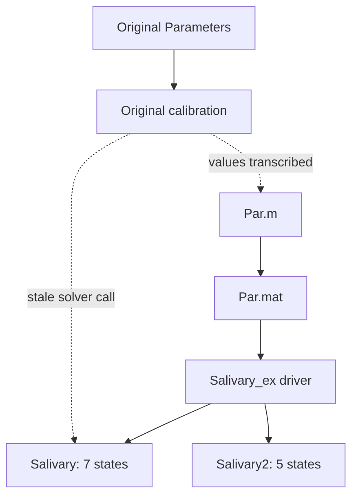

# Historical MATLAB code lineage

## Scope, handling, and conclusion

This report treats the seven archived MATLAB/MAT files as immutable historical implementation evidence. All were inspected in place and none was modified. `Par.mat` was read non-destructively with `scipy.io.loadmat(..., mat_dtype=True)`. MATLAB and Octave are unavailable in the execution environment, so the dependency and lineage conclusions below come from complete static inspection, exact evaluation of the parameter assignments, and an independent numerical evaluation of the displayed calibration formulas. They are not claims that the archived MATLAB was executed literally.

The seven files are not one self-contained release of the published model. They preserve three closely connected strata:

1. `Original/Parameters.m` and the calibration portion of `Original/Saliva_Ae4.m` are a baseline-calibration worksheet. `Saliva_Ae4.m` writes a twelve-component residual ledger, but it does not contain or call a twelve-state right-hand-side function.
2. `Par.m` and `Par.mat` are the parameter handoff from that calibration into a reduced solver. Every one of the 45 fields in `Par.mat` exactly matches `Par.m`, and the calibrated fields in `Par.m` reproduce the formulas in `Original/Saliva_Ae4.m` to the precision printed in the files.
3. `Salivary.m` is a seven-state, algebraically reduced engine; `Salivary2.m` is a five-state fixed-lumen fork of that engine; and `Salivary_ex.m` is their experiment/plot driver.

Structural overlap with the 2018 publication is extensive, so these are credible direct-ancestor or post-publication analysis files. They are not, however, the exact published 2018 executable model as archived: the code uses a sodium-only AE4 cycle, altered channel gating, a step calcium protocol, calibrated water/current scales, and several baseline concentrations different from the paper. The binary parameter file was saved on 2018-10-10, after the article appeared. That date proves only when this copy was serialized, not when its formulas originated.

## Evidence inventory

| File | SHA-256 | Form and role | Direct dependencies |
| --- | --- | --- | --- |
| `archive/legacy-2017/Ae4_Dynamics_Project/Original/Parameters.m` | `fa19bfabd63f0798bbbf72e269a4d469cf00b2b41434bc7d32f614163db20eef` | 98-line script defining geometry, baseline values, kinetic constants, and calibrated water coefficients | None; invoked by `Original/Saliva_Ae4.m:9` |
| `archive/legacy-2017/Ae4_Dynamics_Project/Original/Saliva_Ae4.m` | `7d72a055ab240f658287643520558a592a618845945c01bbdc4cb454f84fdcf3` | 234-line calibration and plotting script; contains a twelve-residual diagnostic and a seven-state solver call | `Parameters.m`, `Par.mat`, `Salivary.m`; attempts to create missing `Conductances.mat` |
| `archive/legacy-2017/Ae4_Dynamics_Project/Par.m` | `06ae901e1c045e234ec08d808bf909539b5d6d8cf009ebd98797791b7d313eff` | 52-line script assembling a 45-field `par` struct | Creates `Par.mat` at line 52 |
| `archive/legacy-2017/Ae4_Dynamics_Project/Par.mat` | `fea3bdbe49dd794d43204bb234bd2b31e6215d784d920f46d3b4300f7068e1ca` | MATLAB v5 binary containing one `1 x 1` parameter struct | Loaded by `Salivary_ex.m:1` and `Original/Saliva_Ae4.m:11` |
| `archive/legacy-2017/Ae4_Dynamics_Project/Salivary.m` | `a6524879c8d948d8be41cdc081c2423b1bda8510943ddd3ce76fab41dc87ed8e` | Seven-state right-hand-side function with algebraic acid/base, chloride, and voltage reductions | Receives `par`, `g4`, and `g2` as arguments |
| `archive/legacy-2017/Ae4_Dynamics_Project/Salivary2.m` | `94e8ddc12e26d4cac0437f3e3d946014c91a1dcffa8fac6072aed56ac010b923` | Five-state fixed-lumen fork | Receives `par`; declared `g4` argument is unused |
| `archive/legacy-2017/Ae4_Dynamics_Project/Salivary_ex.m` | `5f3ecaa2473a3bb409a1ff3dac980dcf356897f42923c50d092ae847f1c6f760` | Driver for both reduced engines and their time-series plots | Loads `Par.mat`; calls `Salivary.m` and `Salivary2.m` |

The complete binary dump is `results/11_forensic_reconstruction/par_mat_inventory.json`.

## Dependency graph and interface integrity



The dotted calibration-to-`Par.m` edge is an inference, but it is exceptionally strong: reconstructing the calibration chain produces the stored `gb`, `aNaK`, `gtna`, `gtk`, `gcl`, `gk`, `g1`, `g2`, and `g4` with maximum relative disagreement about `2.6e-15`, entirely attributable to the number of decimal digits printed. The transformations of the remaining constants are explicit and exact (see below).

The snapshot nevertheless has broken or stale interfaces:

- `Original/Saliva_Ae4.m:9-11` runs `Parameters` and then loads `Par.mat`, although no `Par.mat` exists inside `Original/`; its resolution therefore depends on the working directory or MATLAB path.
- `Original/Saliva_Ae4.m:135` calls `Salivary(t,x,ca,par)`, but the archived `Salivary.m:1` declares and uses two additional arguments, `g4` and `g2` (`Salivary.m:63-66`). That archived combination cannot complete this call without an input-argument failure.
- `Original/Saliva_Ae4.m:126-128` saves `Conductances.mat`, but that file is absent from the 67-file archive.
- `Salivary_ex.m:160` omits the declared fifth `g4` argument to `Salivary2`. The body ignores that argument and instead uses `par.g4` (`Salivary2.m:58-62`), which is evidence of an incomplete refactor even if MATLAB reaches the body without needing the missing value.

These defects are incompatible with treating the directory as a frozen, tested software release. They are fully compatible with a working research snapshot in which a calibration script, a later parameter pack, and multiple exploratory reductions were collected together.

## State dimensions and algebraic eliminations

### Twelve-component calibration residual, not a twelve-state solver

`Original/Saliva_Ae4.m:110-123` evaluates twelve residuals at the prescribed baseline:

| Residual entries | Meaning |
| --- | --- |
| `dx(1:3)` | Luminal Na, K, and Cl balances |
| `dx(4)` | Cell-height/volume balance, `q_b-q_a` |
| `dx(5:10)` | Intracellular Na, K, Cl, HCO3, H, and CO2 amount/concentration balances |
| `dx(11:12)` | Apical and basolateral quasi-steady current balances |

The same script then supplies only seven initial values and calls the external `Salivary` function (`Original/Saliva_Ae4.m:131-135`). The twelve entries are therefore a calibration check, not the state vector of a full dynamic implementation. In particular, the script contains no twelve-state ODE/DAE right-hand side and no capacitance dynamics.

The calibration is sequential and circular by design. The water coefficients set the baseline flow, after which tight-junction conductances are chosen from luminal balances (`Original/Saliva_Ae4.m:65-71`), CaCC from the luminal chloride balance (`:73-75`), buffer and NHE1 scales from the carbon and proton balances (`:77-83`), NaK and CaKC from cation/current balances (`:85-91`), and AE4 and AE2 activities from the remaining Na/HCO3 balances (`:93-102`). Thus an essentially zero baseline residual is a calibration identity for this parameter vector, not independent validation.

### Seven-state engine

`Salivary.m:7-13` fixes the state ordering as

| Index | Stored state | Interpretation |
| ---: | --- | --- |
| 1 | `nal` | Luminal Na concentration |
| 2 | `kl` | Luminal K concentration |
| 3 | `hi` | Cell height, not cell volume |
| 4 | `na` | Intracellular Na concentration |
| 5 | `k` | Intracellular K concentration |
| 6 | `cl` | Intracellular Cl concentration |
| 7 | `hco` | Intracellular HCO3 concentration |

Cell volume is reconstructed as `delta * hi` in `Salivary_ex.m:15`. The geometry in `Original/Parameters.m:3-7` gives `delta = 45.29616724738676 micrometre^2`; `Par.m:51` stores it as `4.52961672473868e-14 L/micrometre`. At `hi=28.7 micrometre`, the volume is exactly `1.3e-12 L` (1.3 pL), tying the height formulation to the paper's baseline geometry.

The seven-state model eliminates five quantities:

- intracellular H is imposed from cellular electroneutrality (`Salivary.m:15`);
- intracellular CO2 is solved from a zero CO2 residual (`:16`);
- luminal Cl is imposed as `nal+kl` (`:17`), so the luminal chloride balance follows from the two cation balances plus apical QSS;
- apical and basolateral potentials are the closed-form solution of the two QSS current equations (`:21-40`);
- total water flow and all transporter/channel fluxes are algebraic (`:43-71`).

The concentration equations use the standard amount-balance expansion: each intracellular row subtracts `dhi/dt` times its concentration and divides by `hi` (`Salivary.m:77-82`). The volume direction is the conservation-consistent `dhi/dt=q_b-q_a` (`:77`).

### Five-state fork

`Salivary2.m` is a near-textual fork of `Salivary.m`, not an unrelated model. It removes the luminal Na and K states, fixes them at 118.7 and 5.6 mM (`Salivary2.m:16-18`), drops their tight-junction and outflow equations, and retains

`[hi, na, k, cl, hco]`

as its five states (`:8-12`, `:70-75`). It also stops exposing the exchanger activities as usable inputs: the body uses `par.g4` and `par.g2` directly (`:58-62`). The QSS voltage expressions remain, so the fixed lumen still affects channel currents even though luminal conservation is no longer integrated.

The later unpublished TeX analysis describes a still smaller three-state Na/K/Cl model with fixed lumen, volume, HCO3, H, CO2, calcium, and potentials (`Ae4_Basis.tex:158-194`; `Marty.tex:12-31`). No matching three-state or MATCONT MATLAB source is in the archive. Therefore `Salivary2.m` may be an intermediate simplification, but it is not the code for the manuscript's final three-state continuation system.

## Equation and convention lineage

### Conserved topology

Across the calibration residual and both reduced functions, the same core topology is preserved: NKCC1, NaK, NHE1, AE2, AE4, CaCC, CaKC, tight-junction Na/K, osmotic water flow, carbon buffer, and CO2 transport. The flux expressions in `Salivary.m:18-71` are direct reorganisations of those evaluated in `Original/Saliva_Ae4.m:20-60`. The explicit QSS voltage solution replaces the two residuals in the calibration ledger but does not introduce voltage states.

Luminal chloride elimination is algebraically defensible under the code's assumptions. Because `cll=nal+kl`, differentiating it and adding the two luminal cation balances gives the chloride outflow relation when the apical QSS current balance holds. It is therefore a genuine reduction, not simply a deleted chloride mechanism.

### Substantive model differences from the published 2018 specification

Several differences are too large to classify as algebraic reductions:

1. **AE4 is sodium-only.** The code's AE4 rate uses intracellular Na in the forward term and extracellular Na in the reverse term (`Original/Saliva_Ae4.m:48-49`; `Salivary.m:62-64`). The complete AE4 flux is subtracted from the Na equation, with no AE4 term in the K equation (`Original/Saliva_Ae4.m:115-116`; `Salivary.m:78-79`). The published model instead uses Na+K in the rate and partitions one monovalent-cation equivalent between the Na and K balances. The historical TeX likewise writes the sodium-only expression (`Ae4_Basis.tex:689-696`), confirming that this was an intentional ancestral variant rather than a transcription slip in one MATLAB line.
2. **The exchanger bath bicarbonate is hard-coded as 21 mM.** Both AE4 and AE2 reverse terms use literal `21` (`Original/Saliva_Ae4.m:49-51`; `Salivary.m:63-66`) even though `Parameters.m:47` sets `HCO3e=40` and the 2018 table reports 42.9 mM. This is an internal implementation split, not a unit conversion.
3. **Channel gates are altered.** `Parameters.m:10-13` and `Par.m:19-22` use `KCaCC=100.26`, `KCaKC=100.3`, `eta1=1.49`, and `eta2=1.7`, rather than the 2018 values 0.26, 0.182, 1.46, and 2.54. The `+100` expressions are explicit. The resulting enormous fitted conductances compensate for tiny channel open probabilities.
4. **The calcium input is different and fully specified only as a step.** Both right-hand sides replace the supplied `ca` by 0.55 at `t>100` (`Salivary.m:3-5`; `Salivary2.m:3-5`); the driver supplies 0.05 before that step (`Salivary_ex.m:9`). This is neither the paper's resting 0.058 micromolar value nor its plotted multistage stimulation protocol.
5. **Water and acid/base terms are calibrated historical conventions.** The code uses three `b` coefficients and `Ie=288.1`, not the published permeability triplet and reported 292.6 mM bath osmolarity. CO2 is eliminated using the paper's printed outward-sign aggregate with coefficient `1.99997` (`Original/Saliva_Ae4.m:60`; `Par.m:11`; `Salivary.m:16`), and the buffer rates are scaled first by 0.012 (`Parameters.m:29-33`) and then by fitted `gb` (`Salivary.m:71`).

These mismatches matter for identity. The code can explain how a baseline was made internally consistent, but that does not show that the same conventions generated the published parameter tables or phenotype curves.

## Parameter lineage and hidden state

### `Par.mat`

The MAT header is:

- format: MATLAB 5.0 MAT-file;
- platform: `MACI64`;
- creation timestamp: Wednesday 2018-10-10 18:18:55;
- top-level stored variables: only `par`, a `1 x 1` struct;
- struct fields: 45, each a `1 x 1` MATLAB `double`;
- global variables: none.

There are no hidden initial states, solver histories, activity sweeps, or output arrays in the binary. The full value/type/shape ledger is in `par_mat_inventory.json`.

Evaluating all 46 assignment statements in `Par.m` in file order (45 distinct fields because `kn` is assigned twice) gave an exact floating-point match to the 45 fields in `Par.mat`: no missing fields, no extra fields, and no numerical mismatches. `Par.mat` is therefore a faithful serialization of the archived `Par.m`, despite the later creation timestamp.

The dump and comparison are executable:

```bash
python analysis/11_forensic_reconstruction/tools/dump_par_mat.py --check
```

The helper is deliberately read-only unless an explicit `--output` path is supplied.

### Explicit transformations from `Original/` to `par`

| `par` family | Relationship to `Original/` | Evidence |
| --- | --- | --- |
| Geometry | `delta` is exactly `(Aa+Ab)/2 * 1e-15`; baseline `delta*Hi0=1.3 pL` | `Parameters.m:3-7`; `Par.m:51` |
| Buffer rates | `kn=2.6e4*0.012=312`; `kp=11*0.012=0.132` | `Parameters.m:29-33`; `Par.m:8-9` |
| CO2 bath sum | `co2le=CO2l+CO2e=11.6+1.6=13.2` | `Parameters.m:49,57`; `Par.m:12` |
| NKCC coefficients | `a2` and `a4` are the Original M-based values multiplied by `1e-12`; the functions are algebraically identical because the Original rate multiplies each concentration by `s=1e-3` | `Parameters.m:35-39`; `Original/Saliva_Ae4.m:45-46`; `Par.m:45-48`; `Salivary.m:59-60` |
| NaK expression | The rearranged `s` powers in `Salivary.m` simplify exactly to the Original M-converted expression | `Original/Saliva_Ae4.m:42-43`; `Salivary.m:18-20` |
| Water coefficients | `b1`, `b2`, `b3` exactly reproduce the staged formulas, including the late `74.4` multiplier on `b1` | `Parameters.m:85-90`; `Par.m:32-34` |
| Luminal osmolyte | `xl` exactly reproduces the displayed baseline water-balance solution | `Original/Saliva_Ae4.m:15-16`; `Par.m:35` |
| AE4 reverse coefficient | Stored `k2=0.00159305881398359` equals Original `1.341840733667157e-5 * 118.7219`; the outer function omits the folded factor | `Parameters.m:81-82`; `Original/Saliva_Ae4.m:49`; `Par.m:37`; `Salivary.m:63` |
| Fixed bath osmotic sum | `Ie=140.2+5.3+102.6+40=288.1`, excluding H and CO2 | `Parameters.m:43-49`; `Par.m:50` |
| Fitted scales | Re-evaluation of the Original sequential calibration reproduces `gb`, `aNaK`, `gtna`, `gtk`, `gcl`, `gk`, `g1`, `g2`, and `g4` to printed precision | `Original/Saliva_Ae4.m:65-102`; `Par.m:6,13,24-31` |

The NKCC transformation is particularly informative. The outer code uses `a2=2.0096e-5` and `a4=1.3852e-6` with mM states, exactly the M-to-mM fourth-order conversion supported by the Palk corrigendum. This is algebraically equivalent to the Original code's use of the large M-based coefficients with `s=1e-3`. It is not an ad hoc repair made after the archive was found.

### Calibration target recovered from the files

Independent evaluation of the historical formulas at the seven-state initial row

`[Nal, Kl, hi, Na, K, Cl, HCO3] = [118.7, 5.6, 28.7, 25, 120, 50, 10]`

and `Ca=0.05`, with both exchanger activities present, gives the historical algebraic values `H=1.23026877e-4 mM`, `CO2=6.60012370 mM`, `Va=-50.24 mV`, and `Vb=-62.8 mV`. The unscaled seven residuals are between about `4e-16` and `5.3e-12` in their code-native units; after the explicit `10000` multiplier they remain below `5.3e-8`. This near-zero result is expected because the conductances and activities were solved from the same row.

Setting either exchanger activity to zero at that same initial row does not preserve the steady state. The driver correctly lets the state relax after knockout rather than treating the WT row as a knockout equilibrium. The numerical trajectory and final phenotype belong in `reproduction.md`; the point here is that the baseline provides direct evidence of the calibration lineage.

## Solver, calcium, time, knockout, and output conventions

| Convention | Seven-state path | Five-state path | Forensic interpretation |
| --- | --- | --- | --- |
| Solver | `ode15s`, relative and absolute tolerances `1e-6` (`Salivary_ex.m:2,9`) | Same (`:160`) | Stiff ODE treatment; no DAE initialization, Jacobian, or maximum step |
| Integration interval | `[0,200]` | `[0,200]` | Code time unit is not documented |
| Calcium | 0.05 until `t=100`, then 0.55 | Same | Exact step protocol, unlike published plotted drive |
| RHS multiplier | `10000` (`Salivary.m:83`) | `1000` (`Salivary2.m:77`) | Hidden and model-version-specific time rescaling; prevents a common physical time interpretation without further evidence |
| AE2 activity | Explicit `g2` argument | Fixed `par.g2` | Seven-state engine supports a knockout; five-state fork does not expose it |
| AE4 activity | Explicit `g4` argument | Fixed `par.g4` despite a declared argument | Incomplete five-state refactor |
| Driver condition | `g4=par.g4`, `g2=0` (`Salivary_ex.m:6-9`) | Both stored activities | The block labelled `Full Model` is actually an AE2-knockout run, where “full” refers to state dimension, not WT genotype |
| Outputs | State, flux, and normalized flow plots | State plots | No `saveas`, `print`, or numeric result export |

Two plotting details limit figure attribution. The seven-state driver labels subplot 7 as luminal chloride but plots intracellular `cl` rather than calculated `cll` (`Salivary_ex.m:82-89`). It later executes `close all` before the fixed-lumen plots (`:158-172`) and reuses figure number 2. None of these functions saves an EPS/PDF. Consequently, the archived Figure1--Figure20 files cannot be attributed to this driver merely from their presence; the later TeX describes MATCONT continuation outputs for which the source code is absent.

## Likely development lineage

| Proposed relation | Confidence | Evidence and limitation |
| --- | --- | --- |
| `Original/Parameters.m` plus the first 123 lines of `Original/Saliva_Ae4.m` are the calibration source of `Par.m` | **Very high** | Exact algebraic transformations and fitted values reproduced to printed precision; not based on directory name |
| `Par.mat` is generated from the archived `Par.m` | **Confirmed** | 45/45 fields and values match exactly; MAT header supplies timestamp/platform |
| `Salivary.m` is the executable reduction of the Original twelve-residual ledger | **Very high** | Same flux formulas, same calibration row, and exact elimination of H, CO2, luminal Cl, and QSS voltages; seven-state IC is shared |
| `Salivary2.m` is a later or parallel fixed-lumen fork of `Salivary.m` | **Very high structurally; chronology only likely** | Near-textual identity with precisely the luminal states/fluxes removed; no independent timestamp establishes which file was saved first |
| `Salivary_ex.m` is the orchestration layer for both reduced functions | **Confirmed** | Direct calls and state extraction; includes exploratory KO and plotting choices |
| The `Original/` pair is a complete earlier/full 2018 implementation | **Rejected** | It contains a full residual audit but no full dynamic solver, has a stale solver signature, and depends on later outer assets |
| These files generated the exact 2018 published simulations | **Unlikely on this snapshot alone** | Strong topological ancestry, but substantive AE4/gating/calcium/parameter differences and a post-publication MAT timestamp; no published figure is recreated or saved by the archived driver |

The most defensible description is therefore: **a directly related calibration-and-reduction branch of the AE4 project, probably derived from an ancestral sodium-only form of the model and subsequently used for the Golubitsky mathematical-analysis work, but not a preserved executable release of the final 2018 publication model.**

## Reproduction consequences

1. The plausible runnable combination is `Par.mat` + `Salivary.m` + the first block of `Salivary_ex.m`. It must be copied outside `archive/` if literal execution becomes possible.
2. `Original/Saliva_Ae4.m` is useful for reconstructing calibration and checking twelve balance equations, but it cannot be paired with the archived `Salivary.m` unchanged because its call omits used inputs.
3. `Salivary2.m` is a separate reduced experiment with fixed lumen and a different factor-of-ten time scaling. Its trajectories must not be mixed with seven-state results.
4. The historical baseline should be judged under its own bespoke calibrated parameters first. It must then be compared separately with the published baseline; parameter agreement cannot be assumed.
5. Any clean 2018 reconstruction would need independent equations and explicit provenance for every recovered convention. In particular, the sodium-only AE4 code must not silently replace the published Na/K-coupled cycle.
