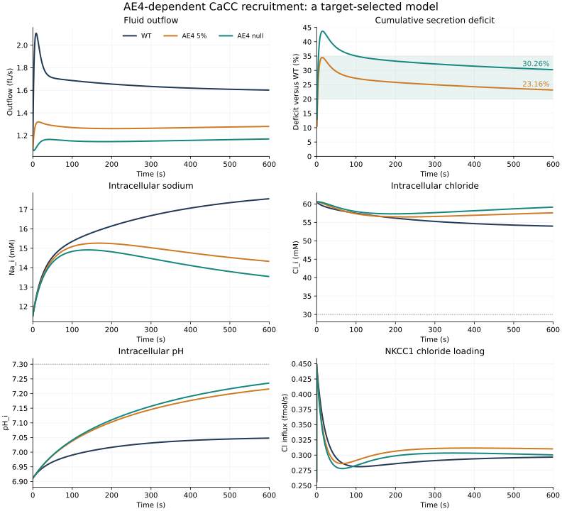

The amended model achieves the requested 20-35% loss of cumulative
secretion over 600 seconds: **23.16% at 5% AE4** and
**30.26% at zero AE4**. WT is exactly the completed Task 40
model. This is a target-selected model, not independent experimental
validation or proof that the added biological dependency exists.

The successful amendment is an explicit dependence of stimulated CaCC
recruitment on AE4 expression. AE4's 50:50 sources and total cycle law are
unchanged. None of the NKCC1 ceilings, pump changes, pH gates, or NBC/AE4
capacity changes explored algebraically is present in the final model.

| Case | Cumulative secretion, 0-600 s (pL) | Ratio to WT | Deficit | Absolute deficit (pL) | Flow deficit at 600 s |
|---|---:|---:|---:|---:|---:|
| WT | 0.992524544 | 1.000000 | 0.00% | 0.000000000 | 0.00% |
| AE4 5% | 0.762622459 | 0.768366 | 23.16% | 0.229902085 | 20.11% |
| AE4 null | 0.692175197 | 0.697388 | 30.26% | 0.300349347 | 27.04% |

The necessary balance condition is a sustained reduction in secreted salt
that compensation and release from intracellular stores do not erase.
Stoichiometry alone does not identify a unique mechanism producing that
condition. With NKCC1 cycles N, AE4 inward chloride cycles A, NBC cycles B,
NHE1 flux H, AE2 inward chloride E, and total pump cycles P, the inherited
equal-routing balances are exactly

$$
\dot n_{Na,i}=N+H+B-\tfrac12 A-3P,\qquad
\dot{TA}_i=H+2B-2A-E,
$$
$$
\dot n_{Cl,i}=2N+A+E-J_{CaCC}.
$$

Eliminating N, B and E gives the exact transient identity

$$
J_{CaCC}=6P-H+2\dot n_{Na,i}-\dot{TA}_i-\dot n_{Cl,i}.
$$

At stationary state, this becomes J_CaCC=6P-H. There is no direct AE4 term
remaining at the 50:50 split, although AE4 changes the coupled states and
therefore the pump, NHE1 and other fluxes. Loss of AE4 need not raise Na_i:
the loss of its bicarbonate export also changes NBC's Na input through the
alkalinity balance. The full cell-plus-lumen chloride identity is

$$
q_{out}[Cl]_l=2N+A+E-J_{para,Cl}
-\frac{d}{dt}(n_{Cl,i}+n_{Cl,l}).
$$

Thus the AE4 share of positive chloride loading is not itself a water
deficit. Paracellular return, luminal composition and stored chloride all
matter. The capacity-only test demonstrated this: it gave only 13.86%
cumulative loss at 5% AE4 and depleted null chloride below the inherited
30 mM floor before 600 s. The complete [attempt ledger](attempt_ledger.md)
retains that failure and every discarded algebraic design.

The selected added hypothesis is

$$
g_{CaCC}=g_{parent}\{(1-a)+a[b+(1-b)e_{AE4}]\},
$$

where a is the existing normalized calcium activation and e_AE4 is AE4
expression. The calcium input and its existing channel gate are retained.
The additional factor is applied to conductance before the full electrical
closure, including NBC. There is no multiplier on computed secretion.

The selected value is **b=0.10511872843288**. At full stimulation, CaCC conductance
is 100% of its parent value in WT, 14.9863% at 5% AE4,
and 10.5119% in the null. This assumes that about 89.49% of full stimulated
recruitment depends on AE4. That is a strong, unvalidated coupling; a 30%
secretion loss does not imply only a 30% conductance reduction.

An initial full stationary balance solution gave b=0.08140757 for 30%
sustained loss. Its finite-time simulations instead gave 26.18% / 35.69%
cumulative loss. One closed-form correction used the two already available
null trajectories (Task 40 and that first recruitment model). The surrogate
Q(g)=Qinf*g/(g+k) gave k=0.04588248, Qinf=0.99802085 pL and the final b above
for approximately 30% cumulative loss. This is a design approximation, not
an exact identity of the ODE. No trajectory optimizer or sweep was used.
The final simulations produced 23.16% / 30.26%, without further adjustment.

The source vector remains (-0.5A,-0.5A,+A,-2A,-2A) in Na/K/Cl/TIC/TA order.
Its charge-equivalent source is (-0.5-0.5-1+2)A=0; reversing A reverses all
five sources. The inherited total AE4 cycle, Palk NKCC1 law and alpha_eff,
1/1.75 NKCC1 stimulation, NBC and NHE1 kinetics, pump, other channels,
acid/base closure, paracellular parameters, water, geometry and stimulus
retain their Task 40 values. Only the new CaCC recruitment dependency is
added. AE4 expression now affects both AE4 transport and this explicit
channel recruitment law.

WT exactly nests Task 40 at every state, so no new resting solve was needed
for the selected model. All three final trajectories use the identical WT
rest SHA-256 `a0b96ef16e5967de4dfe2bdabb882f2a28d478e211f920bc19cd735a5a143acb`. WT cumulative output also reproduced
Task 40 bit for bit. The three final Radau integrations completed without
retry, using the inherited 600 s protocol, tolerances and maximum step.

| Readout at 600 s | WT | AE4 5% | AE4 null |
|---|---:|---:|---:|
| Na_i (mM) | 17.554236 | 14.323384 | 13.540504 |
| K_i (mM) | 110.925054 | 117.898126 | 119.416531 |
| Cl_i (mM) | 53.979919 | 57.590387 | 59.133861 |
| HCO3_i (mM) | 7.502555 | 15.256360 | 16.438583 |
| pH_i | 7.047833 | 7.215559 | 7.235749 |
| Cell volume (pL) | 1.401541 | 1.629495 | 1.691814 |

**Na_i does not become higher than WT in the final model** on the saved
one-second grid or at the endpoint. It ends 3.231 mM lower at 5% AE4 and
4.014 mM lower in the null. The target secretion loss is therefore achieved
without reproducing a higher-Na_i loss phenotype.

Intracellular chloride persists: the final mutant concentrations are 3.610
and 5.154 mM above WT. Their minima over all monitored states are 56.476
and 57.312 mM. Mutants retain chloride amount as well as concentration:
final chloride amounts are 93.843 / 100.043 fmol, compared with 75.655 fmol
in WT and 88.032 fmol at the shared start. Cell volume also increases to
1.629 / 1.692 pL, versus 1.402 pL in WT. These changes should not be
described as preserved overall homeostasis merely because the gates pass.

The following values integrate signed fluxes over 60-600 s except where
positive loading is specified. Parenthetical percentages are relative to
the final model's WT.

| Flux integral (fmol; pump/NBC in cycles) | WT | AE4 5% | AE4 null |
|---|---:|---:|---:|
| Positive NKCC1 Cl loading | 156.872177 | 165.786130 (+5.68%) | 161.256161 (+2.79%) |
| Positive AE4 Cl loading | 41.055502 | 4.178313 (-89.82%) | 0.000000 (-100.00%) |
| Positive AE2 Cl loading | 0.000000 | 0.359218 | 0.403626 |
| NBC | 39.110273 | 10.085143 (-74.21%) | 7.468569 (-80.90%) |
| NHE1 | 4.056565 | 1.982052 (-51.14%) | 1.872518 (-53.84%) |
| Pump | 32.721489 | 30.571643 (-6.57%) | 29.721301 (-9.17%) |
| CaCC Cl export | 207.327263 | 165.072340 (-20.38%) | 151.594378 (-26.88%) |
| Paracellular Cl return | 76.823455 | 64.613220 (-15.89%) | 60.408746 (-21.37%) |

AE2 positive loading is small but present: 0.2109% / 0.2497% of the positive
chloride-loading pool, versus zero in WT. NBC and NHE1 decrease markedly;
pump cycles decrease by 6.57% / 9.17%. The smaller chloride export and its
associated electrical changes reduce paracellular chloride return too.
The higher retained chloride weakens the NKCC1 compensation that previously
masked AE4 loss. No NKCC1 capacity restriction is present in this model.

| NKCC1 compensation, 60-600 s | AE4 5% | AE4 null |
|---|---:|---:|
| Task 39 | +29.65% | +33.10% |
| Task 40, 50:50 routing alone | +20.82% | +23.16% |
| Final Task 41 | +5.68% | +2.79% |

Cumulative deficits below are differences in integrated fluid output from
time zero. Percentage deficit is undefined at time zero because both
cumulative volumes are zero.

| Time (s) | WT cumulative (pL) | 5% deficit (pL; %) | Null deficit (pL; %) |
|---|---:|---:|---:|
| 60 | 0.108753 | 0.031338; 28.82% | 0.040291; 37.05% |
| 120 | 0.210191 | 0.056380; 26.82% | 0.072502; 34.49% |
| 180 | 0.310376 | 0.080796; 26.03% | 0.103909; 33.48% |
| 240 | 0.409559 | 0.104331; 25.47% | 0.134337; 32.80% |
| 300 | 0.507945 | 0.126972; 25.00% | 0.163808; 32.25% |
| 360 | 0.605695 | 0.148796; 24.57% | 0.192416; 31.77% |
| 420 | 0.702938 | 0.169906; 24.17% | 0.220273; 31.34% |
| 480 | 0.799774 | 0.190401; 23.81% | 0.247486; 30.94% |
| 540 | 0.896282 | 0.210373; 23.47% | 0.274150; 30.59% |
| 600 | 0.992525 | 0.229902; 23.16% | 0.300349; 30.26% |

The percentage losses peak earlier (34.53% at
14 s and 43.66% at
15 s on the one-second grid), then decline to the reported
600 s values. The absolute cumulative deficits continue to grow. The
20-35% criterion applies to the final cumulative observation, not every
earlier time point. Final instantaneous flow deficits are 20.11% / 27.04%.

All accepted solver endpoints and integer-second dense samples passed the
unchanged positivity, Na/K/Cl, pH, volume and conservation checks. Source
tests verified exact WT nesting, recruitment boundaries, unchanged AE4 and
homeostasis sources at fixed state, no water-output rescaling, and the
coupled current/Na/alkalinity/chloride identities. The final parameter also
passed recruitment and current-conservation checks at all three expressions
before production. Pointwise conservation remained within every inherited
tolerance. The separate 1 s trapezoidal chloride-amount audit differs from
the actual amount change by at most 0.003081 fmol; this is quadrature error,
not an ODE conservation residual.

The null's mean 60-600 s secretion is only 1.072 times the shared rest rate.
It does not meet the WT-only 1.10-fold stimulation criterion; that criterion
is required of WT, which passes at 1.519-fold. All mutants remain above the
rest rate at 600 s.

Validity is demonstrated for 600 seconds only. The earlier recruitment
design's limiting null pH was 7.3191, above the inherited 7.3 bound. The
corrected parameter has not been given a long-run validation, and mutant
pH is still rising at 600 s. The secretion range was used for selection
and correction; proximity to the approximately 35% experimental deficit is
not held-out evidence. Measurements of stimulated CaCC recruitment and
the concurrent Na/Cl/pH/volume responses would be needed to evaluate this
specific hypothesis. Algebra plus one output range does not identify it
uniquely.

The public selected-model driver is
[task41_selected.py](../../src/modern_full_model/task41_selected.py), which
uses the frozen [recruitment engine](../../src/modern_full_model/ae4_cacc_recruitment.py).
Its mocked integration-dispatch test confirms that the solver receives the
amended RHS; the test runs no additional trajectory. Use the public driver
or the recorded gated runner, rather than delegating integration to the
underlying parent model.
Its selected parameter and all trajectories are in
[candidate_08](../../results/41_ae4_loss_algebraic_design/candidate_08).
The [summary](../../results/41_ae4_loss_algebraic_design/final_summary.json),
[completion ledger](../../results/41_ae4_loss_algebraic_design/completion.json),
[attempt ledger](attempt_ledger.md), and source scripts preserve the entire
target-directed history. Work remains on the requested branch; no merge
to main is part of this task. Scientific execution stops here.
